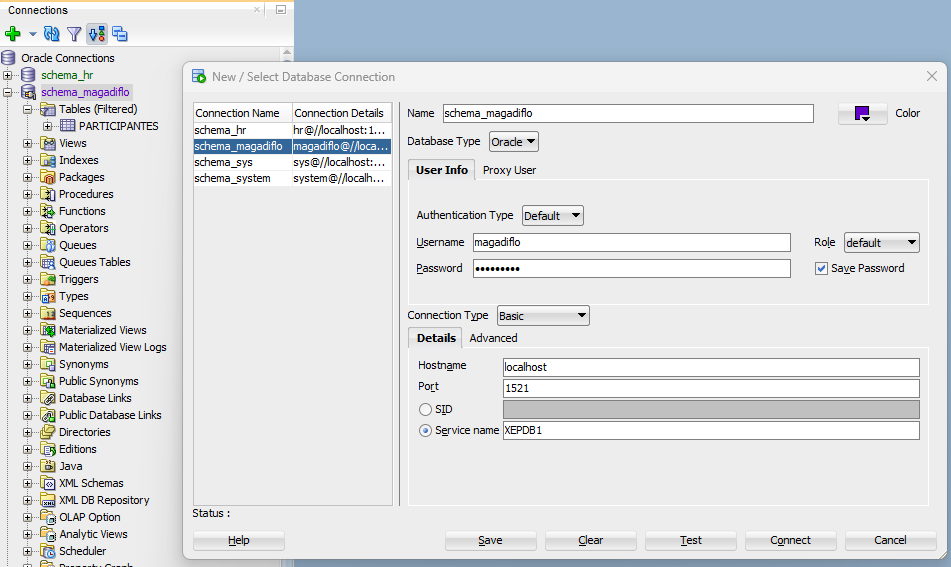

## Documentar API Rest con Swagger

Tomado del canal de youtube **QBOInstitute**  
**Título del video:** [*Taller Virtual: Documenta tu API REst con Swagger*](https://www.youtube.com/watch?v=pW8ffjMbd2k)

### Uris de acceso

NOTA: Tener en cuenta el puerto del proyecto con el que se esté trabajando

```
#API Rest del proyecto en objeto JSON
http://localhost:9950/v2/api-docs
```

```
#API Rest del proyecto en html (swagger-ui)
http://localhost:9950/swagger-ui/index.html
```

## Usuario magadiflo

Vamos a crear al usuario `magadiflo`. Este usuario contendrá todos los objetos para este proyecto: tables, stored
procedures, views, etc.

Podemos usar `SQL Developer` para acceder con el usuario `system` y poder crear a partir de él el usuario `magadiflo`.

Entonces, conectados con el usuario `system` en `SQL Developer` ejecutamos las siguientes instrucciones:

1. Creamos al usuario `magadiflo` con password `magadiflo`.
    ````sql
    CREATE USER magadiflo
    IDENTIFIED BY magadiflo;
    ````

2. Le otorgamos todos los permisos al usuario `magadiflo`, es por eso que le colocamos `DBA`:
    ````sql
    GRANT DBA TO magadiflo;
    ````

Con el usuario `magadiflo` ya creado y con los permisos otorgados creamos una conexión en `SQL Developer` para poder
interactuar con las tablas que en él se vayan creando.

